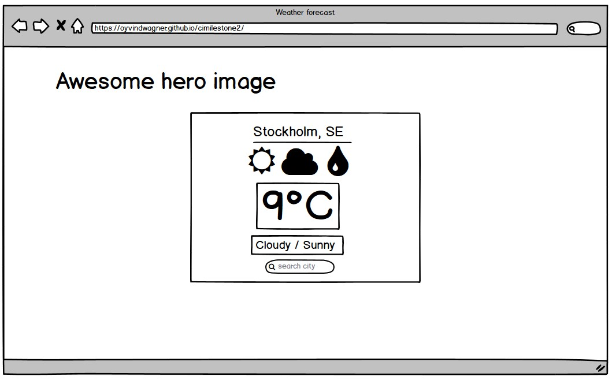

  
# Weather App
This is a weather app website made using HTML, CSS and vanilla JavaScript with the help of an API.
  
## External user's goals:
A website with basic information on weather such as current temperature, high-low temperature and simple weather conditions (cloduy, sunny etc.)

## Site owner's goal:
To provide a simple and minimalist website, containing the basic and necessary information on todays weather.
  
## Wireframe:
As displayed in the wireframe below, the intent was to create a simple layout with the possibility to search for any location in the world and provide simple and understandable information - and at the same time drop any unnecessary functions.
  
  
  
## Website structure:
The website is presented in a one page layout, optimalized for mobile but also works very well on tablet, laptop and desktop sizes. The page contains 6 features, they are:
  
### Searchbar
A searchbar for inputting the area one wishes to see current weather conditions for.
  
### Location information
This section displays the area name and country code.

### Current temperature
This section displays the current temperature.
  
### Weather condition
This section displays the current weather condition (Rain, Thunderstorm, Sunny etc.)
  
### Low/High temperature
This sections displays the current day's lowest and highest temperature.
  
## Design
The website was built with a minimalistic approach in mind. Allowing quick and easy input and easy to understand feedback.
  
## Built with
* HTML  
* CSS  
* JavaScript

This website uses an API from Open Weather Map, that makes calls to a restful API and returns the current weather data. This uses a modern fetch approach.
  
The website was coded in Visual Studio Code - https://code.visualstudio.com/
  
## Testing
* http://ami.responsivedesign.is/ was used to check responsiveness on different Apple products.
  
* With the help of friends and family the website has been tested on different computers and mobile phones, including iPhone 12, Sony Xperia Z3 Compact and Huawei P10.
  
* The website has been tested on Chrome, Edge and Firefox on Windows 10 and Chrome and Firefox on Ubuntu (version 20.04).
  
* Tested the searchbox input by searching different locations and observing the feedback receieved.
  
* The HTML and CSS validator at W3 (https://validator.w3.org/) was used when testing the code. 
  
## Deployment
The code is hosted on my own personal GitHub page, the link to the repository is https://github.com/oyvindwagner/cimilestone2
  
To achieve this I created an account on GitHub, created a new repository where the code and files for the project are hosted.

The website is deployed to the internet using GitHub pages, the link to the project is https://oyvindwagner.github.io/cimilestone2/
  
To achieve this I went to the "Settings" tab on the repository page, under the section "GitHub Pages" it is possible to publish the contents of the repository to the web.
  
## Sources 
  
### Fonts
This website uses "IBM Plex Sans" retrieved from Google Fonts at https://fonts.google.com/
   
### Images:
All images from https://www.unsplash.com and from the following photographers:  
  
Michał Parzuchowski at https://unsplash.com/@mparzuchowski
  
### Code
Tutorial by Tyler Potts at https://www.youtube.com/channel/UCBBGM84ZOs7z5jpTQAaZ_Hg
Open Weather Map API documentation at https://openweathermap.org/guide
  
## Notes

  
This website is built for educational purposes only.  
  
  